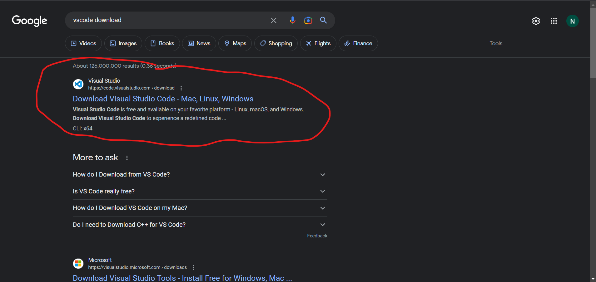
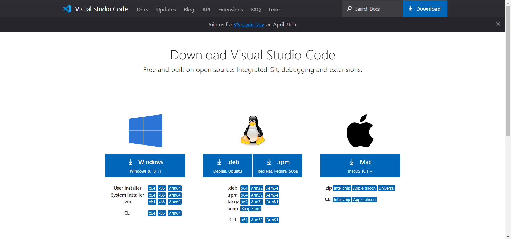
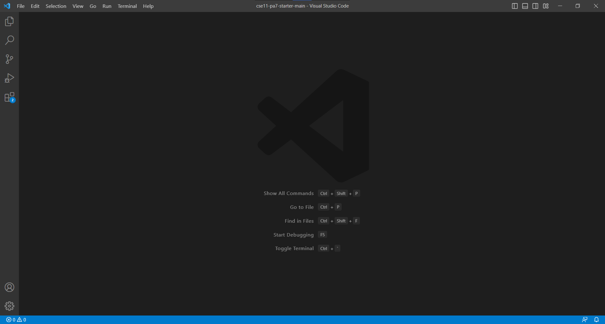

# **Lab Report 1**
## Installing VScode
First, search "vscode download" in your search engine and click the link that says "Download Visual Studio Code - Mac, Linux, Windows".

Then, click the download link for your respective OS and complete the steps for installation.

Finally, open the VScode application. If your screen looks like the image below, you have completed the installation of VScode.

## Remotely Connecting
