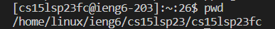
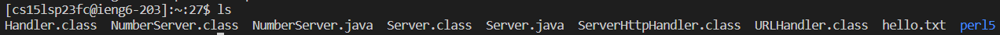
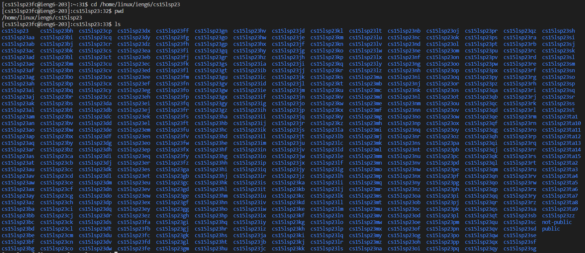

# **Lab Report 1**
## Installing VScode
Follow this link [https://code.visualstudio.com/download](https://code.visualstudio.com/download) then click download for your respective OS and complete the steps for installation.

Then, open the VScode application. If your screen looks like the image below, you have completed the installation of VScode.

## Remotely Connecting
First, reset the password to your CSE15L Account by following these steps:
1. click this link: [https://sdacs.ucsd.edu](https://sdacs.ucsd.edu/~icc/index.php)
2. enter your username (the same as in your ucsd email) and PID where it says account lookup

3. select your cs15l account

4. click the link that says "Global Password Change Tool"

5. click the link that says "Proceed to the Password Change Tool"

6. enter your unique CSE15l account username and follow the steps to reset your password
 

Once you reset your password, remotely connect by following these steps:
1. if you use windows, download git by going to this link [https://gitforwindows.org](https://gitforwindows.org/), select download, and complete the steps for installation

2. open VScode and open a new terminal

3. Open the command palette using Ctrl + Shift + P and type and select "Select Default Profile"

4. select GitBash

5. click on the + icon in the terminal window and the new terminal should be a Git Bash terminal

6. in your terminal, enter `$ ssh cs15lsp23zz@ieng6.ucsd.edu` with `zz` being replaced by the two letters in your course account (you don't type the `$`)

7. enter `yes` if you get the message:
`The authenticity of host 'ieng6.ucsd.edu (128.54.70.227)' can't be established. RSA key fingerprint is SHA256:ksruYwhnYH+sySHnHAtLUHngrPEyZTDl/1x99wUQcec.
Are you sure you want to continue connecting (yes/no/[fingerprint])?`

8. when prompted with `Password:`, type in the password you set for your account earlier (nothing will show up as you type in the password, it is not a mistake)

10. if you have logged in successfully, your terminal output should look like this:

## Using Commands
Next, you should try running some commands on the terminal. Here are some commands you can try and a short description of what they do:
- `pwd`: displays the path to your current working directory

- `cd <path>`: switches the current working directory to the given path

- `ls <path>`: displays a list of the files and folders in the given path

- `cat <path1> <path2>`: displays the ocntents of one or more files given by the paths

