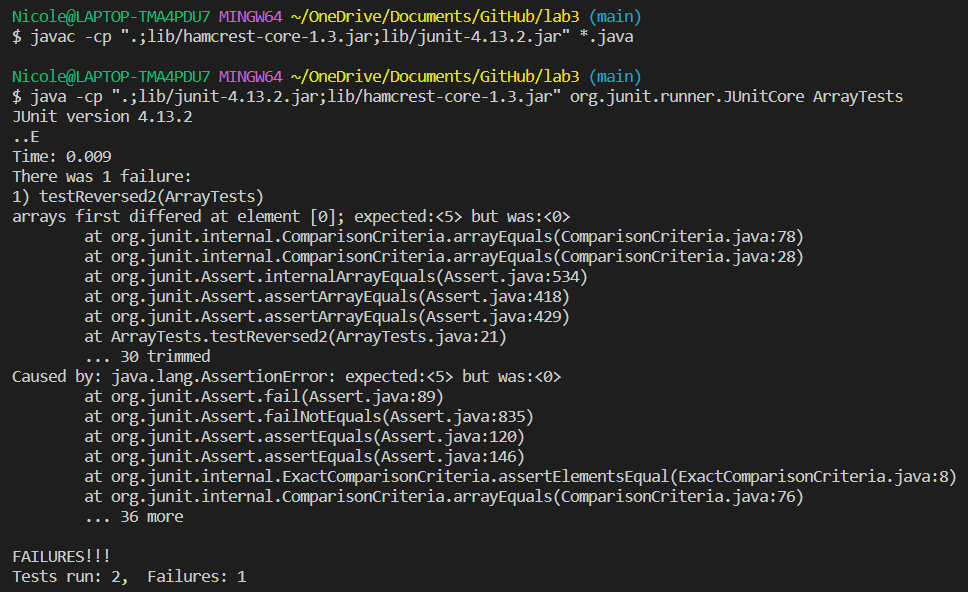

# **Lab Report 2**
## Part 1
```
import java.io.IOException;
import java.net.URI;

class Handler implements URLHandler {

    String s = "";

    public String handleRequest(URI url) {
        if (url.getPath().equals("/add-message")) {
            String[] parameters = url.getQuery().split("=");
            if (parameters[0].equals("s")){
                s += parameters[1] + "\n";
                return s;
            }
        } 
        return "404 Not Found!";
    }
}

class StringServer {
    public static void main(String[] args) throws IOException {
        if(args.length == 0){
            System.out.println("Missing port number! Try any number between 1024 to 49151");
            return;
        }

        int port = Integer.parseInt(args[0]);

        Server.start(port, new Handler());
    }
}
```


When I first run the server, an empty String field `s` is created. The `handleRequest()` method runs with the parameters being the url `http://localhost:7000/add-message?s=hello`. Then in the if statement, the `url.getPath().equals("/add-message")` methods are called to check if the url has a request to add a message, which it does so it returns true. Then, a String array `parameters` is created with the value `{"s", "hello"}`. This is beacuse when the method calls `url.getQuery().split("=")` run, it will take the part of the url that comes after the `?` (i.e. `s=hello`) and splits it at the `=` sign. Then another if statement runs to check if the first element in `parameters` is `"s"` by calling the method `parameters[0].equals("s")` and will return true. Finally, the `s` field created ealier gets updated to include `"hello"` (`parameter[1]`) and a new line (`"\n"`) for future Strings to be added.


When I edit the url to http://localhost:7000/add-message?s=how are you, the `handleRequest()` method runs with the parameters being the url `http://localhost:7000/add-message?s=how are you`. Then in the if statement, the `url.getPath().equals("/add-message")` methods are called to check if the url has a request to add a message, which it does so it returns true. Then, a String array `parameters` is created with the value `{"s", "how are you"}`. This is beacuse when the method calls `url.getQuery().split("=")` run, it will take the part of the url that comes after the `?` (i.e. `s=how are you`) and splits it at the `=` sign. Then another if statement runs to check if the first element in `parameters` is `"s"` by calling the method `parameters[0].equals("s")` and will return true. Finally, the `s` field that was previously updated to `"hello\n"` will be updated to include `"how are you"` (`parameters[1]`) and a new line (`"\n"`) for future Strings to be added.


## Part 2
Buggy program:
```
  static int[] reversed(int[] arr) {
    int[] newArray = new int[arr.length];
    for(int i = 0; i < arr.length; i += 1) {
      arr[i] = newArray[arr.length - i - 1];
    }
    return arr;
  }
 ```
 
 
Failure-inducing input: `int[] input2 = {1, 2, 3, 4, 5};`

Non failure-inducing input: `int[] input1 = {};`

JUnit output:


Fixed program:
```
  static int[] reversed(int[] arr) {
    int[] newArray = new int[arr.length];
    for(int i = 0; i < arr.length; i += 1) {
      newArray[i] = arr[arr.length - i - 1];
    }
    return newArray;
  }
```
