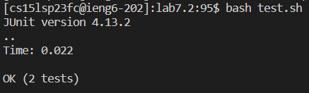

# **Lab Report 4**
## Step 4
Keys pressed: `<up><enter>`

The `ssh cs15lsp23fc@ieng6.ucsd.edu` command was 1 up in my command history, so I used the arrow keys to access it and login to my remote server.

  
## Step 5
Keys pressed: git`<space>`clone`<space><ctrl>`c`<enter>`

I had the link to my fork repositiory in copied in my clip board, so instead of typing out the whole link, I just used `ctrl+c` to access it.
With this command, I cloned the forked repository to my remote machine.

  
## Step 6
Keys pressed: cd`<space>`lab7.2`<enter>`

With this command, I opened the lab7 directory.

Keys pressed: bash`<space>`test.sh`<enter>`

With this command, I ran the tests using the shell file `test.sh`.

  
## Step 7
Keys pressed: vim`<space><shift>`List`<shift>`Examples.java`<enter>`

With this command, I opened the `ListExamples.java` file in the vim editor.

Keys pressed: /index1`<enter>`nnnnnnnnn`<left><left><left><left><left>`xi2`<esc><shift>`;wq`<enter>`

With `/index1`, I searched for instances of index1 in the file, then I pressed `n` 9 times to navigate to the part causing the error. Then I used my left arrow key to move my cursor to the `1` at the end of `index1`, pressed `x` to delete the character, entered insert mode with `i`, then added `2`. Finally I saved my changes with `:wq`.

  
## Step 8
Keys pressed: bash`<space>`test.sh`<enter>`

With this command, I reran the tests to see if the tests passed and the error was fixed.

  
## Step 9
Keys pressed: git`<space>`add`<space><shift>`List`<shift>`Examples.java`<enter>`

With this command, I added the `ListExamples.java` file to be commited.

Keys pressed: git`<space>`commit`<space>`-m`<space>`"modified`<space><shift>`List`<shift>`Examples"`<enter>`

With this command, I commited the modifications to `ListExamples.java`.

Keys pressed: git`<space>`push`<space>`-u`<space><ctrl>`c`<space>`main`<enter>`

With this command, I pushed my changes to my github repository. Since `git@github.com:nicshrly/lab7.2.git` was copied on my clipcoard, I used `ctrl+c` to paste it instead of typing out the whole thing.

