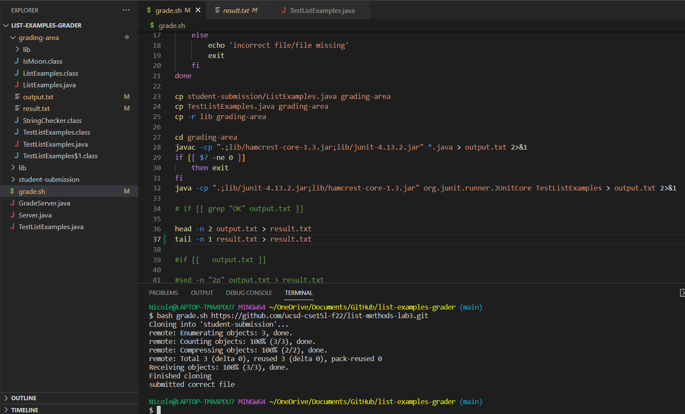
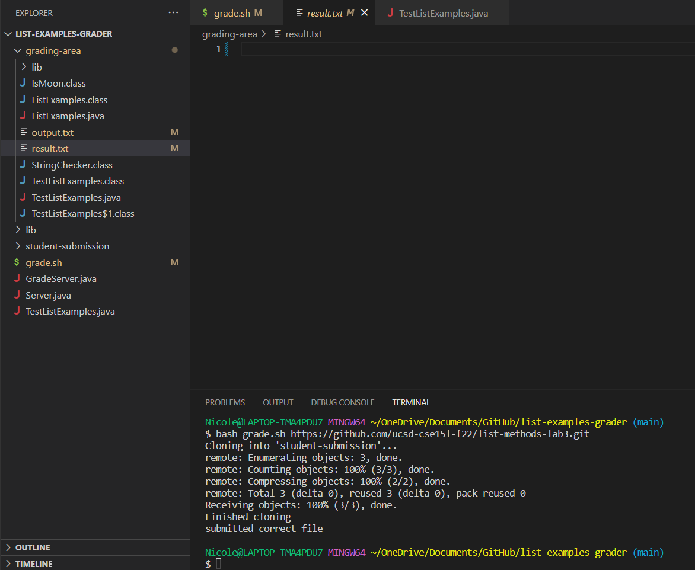
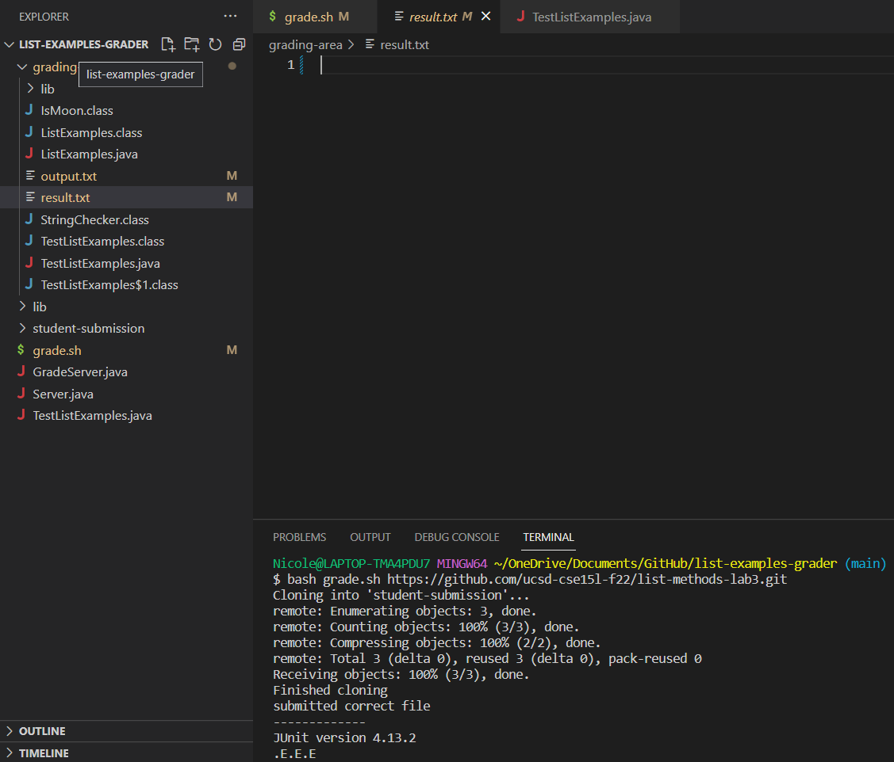
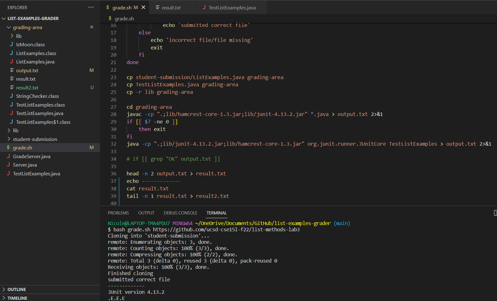
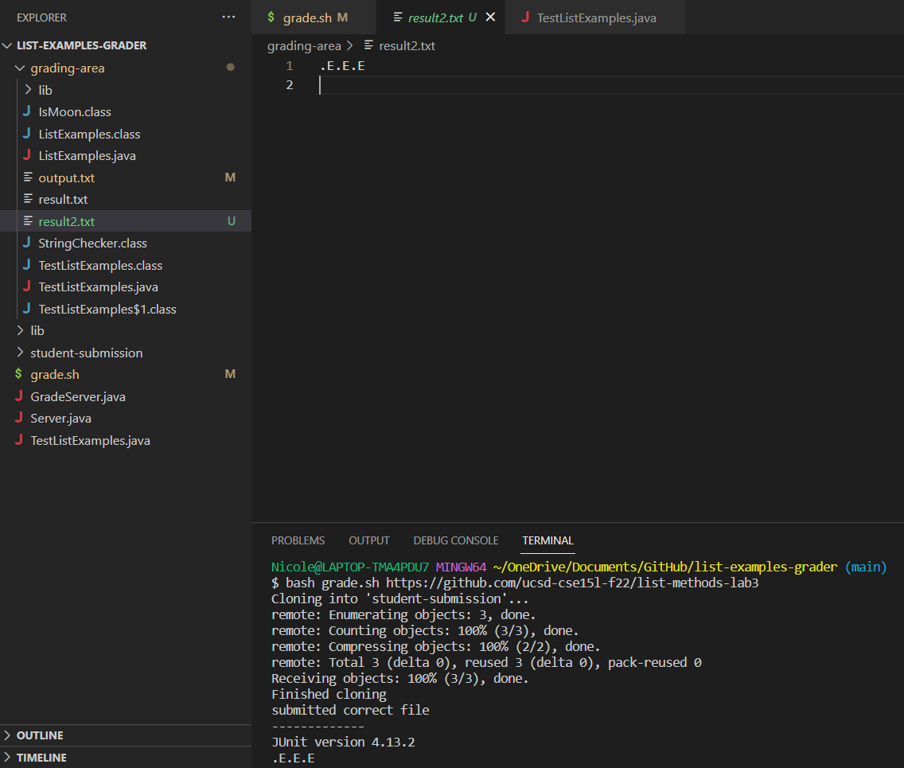

# **Lab Report 5**
## Original Student Post
What environment are you using (computer, operating system, web browser, terminal/editor, and so on)?

  Predator PH315-54, Windows 10, Chrome, VScode, bash terminal

Detail the symptom you're seeing. Be specific; include both what you're seeing and what you expected to see instead.
Screenshots are great, copy-pasted terminal output is also great. Avoid saying “it doesn't work”.

  I am trying to isolate the second line of the JUnit output that has the E's and dots so that I can count the amount of
  errors the student has and give them a grade. The JUnit output is in a file called output.txt and I tried using the head 
  and tail commands to extract the line I want and redirect it to result.txt. However, when I run the commands, result.txt 
  comes back empty. I know I put the right numbers when using the head and tail commands because I counted them. I'm 
  not sure why there is no output.
  
  
  
  

Detail the failure-inducing input and context. That might mean any or all of the command you're running, a test case, command-line 
arguments, working directory, even the last few commands you ran. Do your best to provide as much context as you can.

  Terminal command: 
  
  $ bash grade.sh https://github.com/ucsd-cse15l-f22/list-methods-lab3
  
  Shell file commands:

  head -n 2 output.txt > result.txt
  
  tail -n 1 result.txt > result.txt
  
## Leading TA Response
 
Is the error caused by both the head and tail commands, or could it be just one that is causing the error? Try adding a cat command in between
the head and tail commands to see how each one modfies the result.txt file.
 
## Student Follow-up Response
I added the cat command and it seems like the head command is working as intended since it outputs the first two lines of the JUnit output. The
error must be occuring when I use the tail command and redirect the input back into the result.txt file.
 

 
## TA Solution
Try redirecting the output of the tail command into a different file other than result.txt.
 
## Studnet Follow-up Response
Error fixed, ty! :3 
 

 

 
## Setup Info
I used a fork of the list_examples_grader directory from lab 6. 
 
Content of grade.sh before fixing the bug:
 
```
CPATH='.:lib/hamcrest-core-1.3.jar:lib/junit-4.13.2.jar'

rm -rf student-submission
rm -rf grading-area

mkdir grading-area

git clone $1 student-submission
echo 'Finished cloning'

files=$(find student-submission/*.java)
for file in $files
do
    if [[ -f $file ]] && [[ $file == student-submission/ListExamples.java ]]
        then
            echo 'submitted correct file'
    else
        echo 'incorrect file/file missing'
        exit
    fi
done

cp student-submission/ListExamples.java grading-area
cp TestListExamples.java grading-area
cp -r lib grading-area

cd grading-area
javac -cp ".;lib/hamcrest-core-1.3.jar;lib/junit-4.13.2.jar" *.java > output.txt 2>&1
if [[ $? -ne 0 ]]
    then exit
fi
java -cp ".;lib/junit-4.13.2.jar;lib/hamcrest-core-1.3.jar" org.junit.runner.JUnitCore TestListExamples > output.txt 2>&1

# if [[ grep "OK" output.txt ]]

head -n 2 output.txt > result.txt
tail -n 1 result.txt > result.txt
```

Content of output.txt before fixing the bug:
```
JUnit version 4.13.2
.E.E.E
Time: 1.246
There were 3 failures:
1) testMerge(TestListExamples)
org.junit.runners.model.TestTimedOutException: test timed out after 500 milliseconds
	at ListExamples.merge(ListExamples.java:43)
	at TestListExamples.testMerge(TestListExamples.java:61)
2) testMergeRightEnd(TestListExamples)
org.junit.runners.model.TestTimedOutException: test timed out after 500 milliseconds
	at java.base/java.util.Arrays.copyOf(Arrays.java:3512)
	at java.base/java.util.Arrays.copyOf(Arrays.java:3481)
	at java.base/java.util.ArrayList.grow(ArrayList.java:237)
	at java.base/java.util.ArrayList.grow(ArrayList.java:244)
	at java.base/java.util.ArrayList.add(ArrayList.java:454)
	at java.base/java.util.ArrayList.add(ArrayList.java:467)
	at ListExamples.merge(ListExamples.java:42)
	at TestListExamples.testMergeRightEnd(TestListExamples.java:18)
3) testFilter(TestListExamples)
java.lang.AssertionError: expected:<[test, testt]> but was:<[testt, test]>
	at org.junit.Assert.fail(Assert.java:89)
	at org.junit.Assert.failNotEquals(Assert.java:835)
	at org.junit.Assert.assertEquals(Assert.java:120)
	at org.junit.Assert.assertEquals(Assert.java:146)
	at TestListExamples.testFilter(TestListExamples.java:38)

FAILURES!!!
Tests run: 3,  Failures: 3

```

Content of TestListExamples.java before fixing the bug:
```
import static org.junit.Assert.*;
import org.junit.*;
import java.util.Arrays;
import java.util.List;
import java.util.ArrayList;

class IsMoon implements StringChecker {
  public boolean checkString(String s) {
    return s.equalsIgnoreCase("moon");
  }
}

public class TestListExamples {
  @Test(timeout = 500)
  public void testMergeRightEnd() {
    List<String> left = Arrays.asList("a", "b", "c");
    List<String> right = Arrays.asList("a", "d");
    List<String> merged = ListExamples.merge(left, right);
    List<String> expected = Arrays.asList("a", "a", "b", "c", "d");
    assertEquals(expected, merged);
  }

  @Test(timeout = 500)
  public void testFilter() {
    List<String> input = new ArrayList<>();
    input.add("test");
    input.add("testt");
    input.add("no");

    List<String> expected = new ArrayList<>();
    expected.add("test");
    expected.add("testt");
    StringChecker sc = new StringChecker() {
        public boolean checkString(String s) {
            return s.contains("t");
        }
    };
    assertEquals(expected, ListExamples.filter(input,sc));
  }

  @Test(timeout = 500)
  public void testMerge() {
    List<String> first = new ArrayList<>();
    first.add("a");
    first.add("b");
    first.add("d");

    List<String> second = new ArrayList<>();
    second.add("b");
    second.add("c");
    second.add("e");

    List<String> expected = new ArrayList<>();
    expected.add("a");
    expected.add("b");
    expected.add("b");
    expected.add("c");
    expected.add("d");
    expected.add("e");

    assertEquals(expected, ListExamples.merge(first,second));
  }
}
```

Content of GradeServer.java and Server.java: no changes were made after forking from github

Content of result.txt before fixing the bug: empty

Terminal command used to trigger the bug:

$ bash grade.sh https://github.com/ucsd-cse15l-f22/list-methods-lab3

How to fix the bug:

Simply redirect the output of `tail -n 1 result.txt` into a new file (I called it result2.txt).
The command should look something like `tail -n 1 result.txt > result2.txt`

Content of grade.sh after fixing the bug:
 
 ```
 CPATH='.:lib/hamcrest-core-1.3.jar:lib/junit-4.13.2.jar'

rm -rf student-submission
rm -rf grading-area

mkdir grading-area

git clone $1 student-submission
echo 'Finished cloning'

files=$(find student-submission/*.java)
for file in $files
do
    if [[ -f $file ]] && [[ $file == student-submission/ListExamples.java ]]
        then
            echo 'submitted correct file'
    else
        echo 'incorrect file/file missing'
        exit
    fi
done

cp student-submission/ListExamples.java grading-area
cp TestListExamples.java grading-area
cp -r lib grading-area

cd grading-area
javac -cp ".;lib/hamcrest-core-1.3.jar;lib/junit-4.13.2.jar" *.java > output.txt 2>&1
if [[ $? -ne 0 ]]
    then exit
fi
java -cp ".;lib/junit-4.13.2.jar;lib/hamcrest-core-1.3.jar" org.junit.runner.JUnitCore TestListExamples > output.txt 2>&1

# if [[ grep "OK" output.txt ]]

head -n 2 output.txt > result.txt
echo -------------
cat result.txt
tail -n 1 result.txt > result2.txt
```

Content of result.txt after fixing the bug: 
```
JUnit version 4.13.2
.E.E.E

```

Content of result2.txt after fixing the bug:
```
.E.E.E

```

## Reflection
Something I learned in the seocnd half of the course is output redirection. It can be really finicky and cause unexpexted errors when not used carefully (as demonstrated above), but it can also be really helpful. I also learned that there are two types of output, standard output and standard error output. Sometimes we might want one or both of these outputs, so they can be redirected using commands like `2>` or `2>&1`
